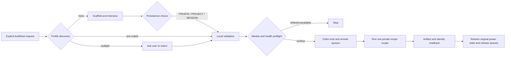

# Build client

`build-client` safely operates a Linux build guest through a paired local VMware
Workstation controller and SSH connection. It is explicit-only: discussion, code
changes, or stale artifacts do not start a build or test.

The public package contains the admission rules, Profile manager, VMware/SSH
adapters, receipt and queue logic, tests, and fictional templates. It contains no
real IP address, personal path, VM identity, SSH key, known-host entry, product
artifact name, or organization-only build procedure.

Concrete environments live outside the repository under
`$CODEX_HOME/profiles/build-client/<binding>/` by default. Each binding contains
an environment Profile, a Build Recipe, and a private provider script. SSH keys
and managed host keys live separately under per-user Codex state, never in a
project Profile. A user can instead choose a sanitized project Profile or
session-only candidate.

Missing Profiles trigger configuration. A newly supplied environment is never
silently persisted. The user chooses `PRIVATE`, `PROJECT`, or `SESSION`. A changed
host key, VMX identity, machine ID, endpoint, or fingerprint is drift and stops
the workflow; it is not automatically saved as another environment.

Build scope names and expected artifact counts come from the private recipe. The
provider emits SHA-256 artifact readbacks while the public adapter owns bounded
execution, target identity, queue ownership, receipts, and restoration of the
original VM power state.

See the installable package at [`skills/build-client`](../skills/build-client/).
