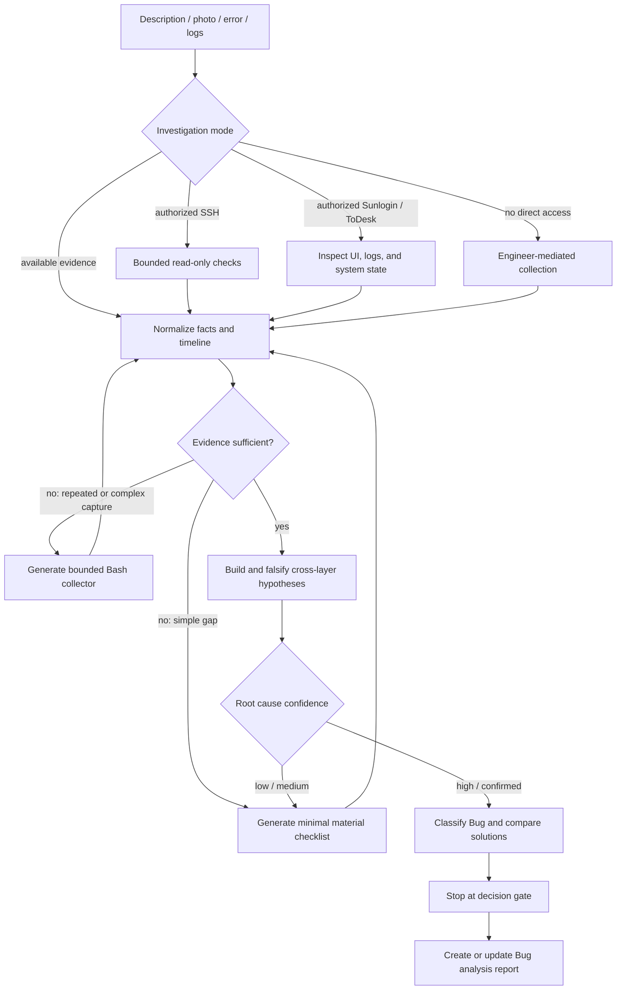

# Linux client Bug troubleshooting

This skill turns Linux client Bug investigation into an evidence-driven,
reviewable workflow without modifying product code or persisting customer
environments.

## Investigation inputs

The skill accepts one or more of the following:

- an engineer's written description of the actual and expected behavior;
- a customer-site photo or screenshot containing an error message;
- exact error text, error codes, or process exit results;
- client, systemd user/system service, kernel, device, or application logs;
- a previously generated diagnostic collection bundle.

It keeps visible facts separate from user assumptions and diagnostic inference.
Logs are correlated by timestamp, timezone, boot/session, host or container, and
PID/TID. A single screenshot, keyword, or last log line is not treated as a root
cause by itself.

## Per-case access channels

The skill can work in four modes:

1. Offline evidence analysis.
2. Read-only checks through an SSH session established and authorized for the
   current case.
3. UI and system inspection through a current, authorized Sunlogin or ToDesk
   session when computer-control capability is available.
4. Engineer-mediated collection when direct customer access is unavailable.

Customer access is ephemeral. The skill does not create or reuse customer
environment Profiles and does not persist IP addresses, internal hostnames,
account names, SSH keys, passwords, jump-host details, Sunlogin/ToDesk device
IDs, verification codes, or temporary passwords. The Bug report records only
the access mode, authorization window, and diagnostic facts needed to support
the conclusion.

## Missing evidence

When the initial input is incomplete, the skill produces a minimal checklist for
the engineer to forward to the customer. Typical first-round items include:

- reproduction steps, frequency, impact, failure time, and timezone;
- client/component version and package type;
- Linux distribution, kernel version, and CPU architecture;
- the exact client, service, and kernel logs around the failure window;
- process exit code, signal, or crash/core availability;
- desktop environment and X11/Wayland session details when relevant.

Each requested item includes its diagnostic purpose, required or optional
priority, collection command or UI path, time window, privilege requirement,
expected format, and redaction guidance. The checklist is hypothesis-specific;
it is not a generic request for all system data.

If manual collection is likely to miss timing, requires continuous observation,
or involves multiple correlated sources, the skill can generate a case-specific
Bash collector. The collector is local-only, read-only by default, resource
bounded, tolerant of missing commands, and produces a manifest and SHA-256
checksum. It never uploads data automatically. Core dumps, packet captures,
process environments, and other high-sensitivity evidence remain separate,
explicitly authorized options.

## Cross-layer diagnosis

The investigation follows symptoms across application and desktop layers into
system services, identity and permissions, storage, networking, cgroups and
resource pressure, kernel and drivers, devices, firmware, and hardware. It keeps
one to three falsifiable hypotheses and records supporting evidence, opposing
evidence, missing evidence, and the next lowest-risk discriminating check.

A confirmed conclusion includes the direct trigger, deepest proven cause,
amplifying factors, affected scope, counterfactual evidence, confidence level,
and checks that were not performed. If the evidence does not close the timeline
or distinguish competing causes, the report remains a draft and labels the root
cause as unconfirmed.

## Solutions and decision gate

After the root cause reaches high or confirmed confidence, the skill classifies
the problem as an emergency, local implementation/configuration defect,
systemic design issue, product requirement issue, third-party/environment issue,
security/data risk, or an item requiring further assessment.

It can compare:

- immediate containment;
- local repair or optimization;
- refactoring, redesign, or architectural remediation;
- third-party or customer-environment coordination;
- risk acceptance or deferral.

Each option identifies applicability, scope, risk, outage requirements,
validation, rollback, residual risk, and the decision that a responsible team
must make. The skill stops at the decision gate by default. It does not edit
product source, create patches or commits, restart services, change security
policy, repair filesystems, replace kernels or drivers, or apply the proposed
solution without separate authorization and an appropriate implementation
workflow.

## Deliverables

The final Bug analysis report captures:

- incident summary, impact, evidence quality, and timeline;
- investigation mode and sanitized environment facts;
- hypothesis evolution and root-cause confidence;
- Bug classification and solution comparison;
- containment, rollback, validation, and department decision items;
- generated collection artifacts and remaining evidence gaps;
- actual external implementation and verification results, when later supplied.

Suggested, approved, externally executed, verified, and rolled-back states remain
distinct so that a recommendation is never presented as an implemented change.

See the installable package at
[`skills/linux-client-bug-troubleshooter`](../skills/linux-client-bug-troubleshooter/).
