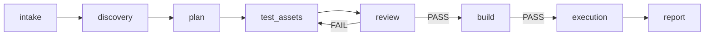

# Linux client white-box test flow

This skill turns white-box testing into an auditable eight-stage workflow:

Each completed stage records evidence and stops for `PROCEED`, `REWORK`, or
`STOP`. One requirement owns one test record and one environment binding. Test
cases remain in the stable part of the record; each execution appends an immutable
batch. Later batches reuse the environment after a read-only identity and health
preflight.

The public package contains no machine addresses, credentials, private filesystem
paths, process names, or organization-specific GUI commands. Put those details in
a private environment profile referenced by `environment.bindingId`.

See the installable package at
[`skills/linux-client-whitebox-test-flow`](../skills/linux-client-whitebox-test-flow/).
