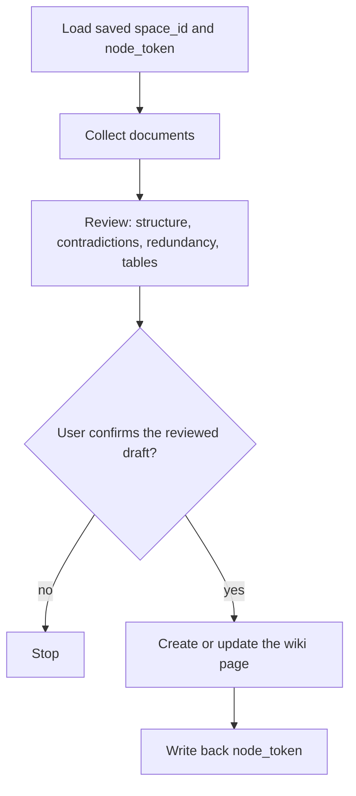

# Work document to Feishu

This skill archives work documents to a bound Feishu wiki after a review pass:

The public package contains no real wiki IDs. Bind `space_id` first, then the parent `node_token`, and keep the result in local `config/wiki-target.json`.

Review keeps meaning and logic unchanged. The draft should read as a plan or report for managers or colleagues: written headings such as 目标 / 方案 / 实施步骤, no 要做什么, no 注意事项 section unless the source already needs one, and no 不要 xxx lists. Tables are only for lookup and comparison (two-row comparisons allowed; a single object uses a tall key/value table). Ordered steps, stage information, and causal argument stay as lists or prose.

Writes go only to the bound wiki. Drive root and “我的空间” are out of scope. Confirm the reviewed draft before `wiki +node-create`, `docs +update`, `drive +import`, or `wiki +move`.

See the installable package at
[`skills/work-document-to-feishu`](../skills/work-document-to-feishu/).
